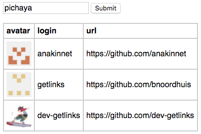

# Node skill test

Please push your code to your Github and send the link to pichaya@getlinks.co

## 1. With Node.js and Express create a page to list followers of a Github user and display it in a table

- Create a form with one textfield and a button
- When click the button show the followers of the Github id

*hint: https://api.github.com/users/pichaya/followers*

---
